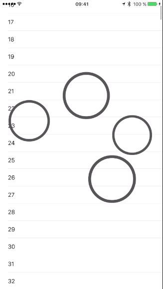
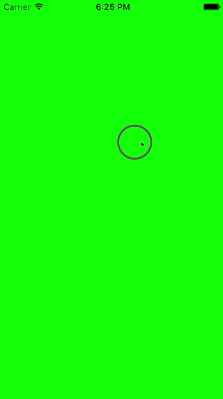

# TouchPresenter

[](https://travis-ci.org/Benjamin Herzog/TouchPresenter)
[](http://cocoapods.org/pods/TouchPresenter)
[](http://cocoapods.org/pods/TouchPresenter)
[](http://cocoapods.org/pods/TouchPresenter)

## What does it do?
This framework provides an UIWindow subclass that highlights every touch. It can be used to create better video presentations of your app.

The idea of this project is heavily inspired by https://github.com/eumlab/EUMTouchPointView

## Example

To run the example project, clone the repo and open the workspace in the Example directory.

<center>


</center>

## Requirements

## Installation

TouchPresenter is available through [CocoaPods](http://cocoapods.org). To install
it, simply add the following line to your Podfile:

```ruby
pod 'TouchPresenter'
```

In the project, you need to import the framework:
```Swift
import TouchPresenter
```

To use the window, just override the init method in your AppDelegate.swift and configure it like you want:

```Swift
override init() {
        let config = TouchPresenterConfiguration(viewType: TPLightBlueCircleIndicator.self, enable3DTouch: true)
        window = TPWindow(frame: UIScreen.mainScreen().bounds, configuration: config)
        super.init()
    }
```

If you are already using a custom window be sure to make it a subclass of TPWindow and call it's initializer as super in your initializer:

```Swift
class MyCustomWindow: TPWindow { ... }
```

It is also possible to use different indicators, there are three kinds provided currently by the framework which is TPLightBlueCircleIndicator, TPRedIndicator and TPCircleIndicator. If you want to use a custom one, just return the type of your custom view, the only requirement is, that it inherits from UIView. (See example project for an example of this)

## Features

- [x] all touches are highlighted (even multiple ones)
- [x] simple indicators are provided
- [x] Enable 3D touch visualization
- [ ] possibility to turn the functionality off temporary
- [ ] add unit tests
- [ ] add travisCI

## Author

Benjamin Herzog, mail@benchr.de

## License

TouchPresenter is available under the MIT license. See the LICENSE file for more info.
